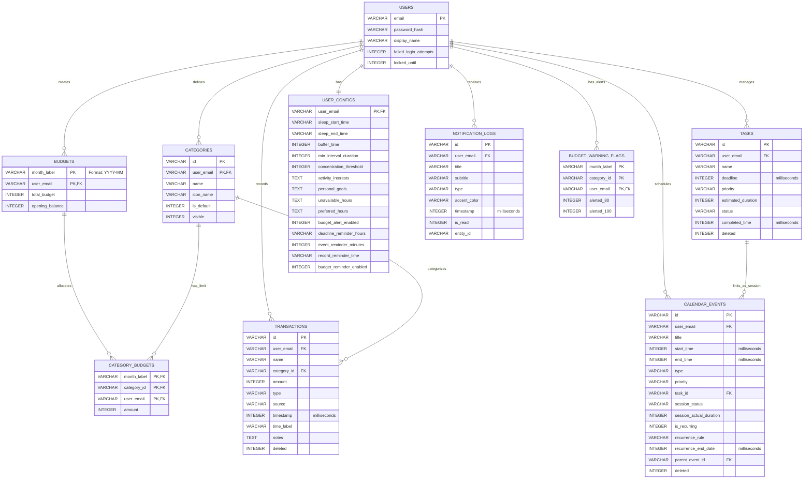

# TÀI LIỆU THIẾT KẾ CƠ SỞ DỮ LIỆU
## Ứng dụng Android Quản lý Chi tiêu & Tối ưu Thời gian cho Sinh viên

Tài liệu này mô tả chi tiết thiết kế cơ sở dữ liệu vật lý (SQLite) sử dụng thư viện Room trong Android, nhằm hỗ trợ và tuân thủ tuyệt đối các quy định nghiệp vụ (SV_QD), quy tắc tính toán (TT) và ca đặc biệt (DB) đã định nghĩa trong tài liệu đặc tả.

---

## 1. Sơ đồ thực thể - mối quan hệ (ER Diagram)

Dưới đây là sơ đồ ERD thể hiện cấu trúc các bảng và mối liên kết giữa chúng trong hệ thống:



---

## 2. Chi tiết các bảng và Ràng buộc nghiệp vụ

### 2.1 Bảng `users` (Tài khoản)
* **Mục đích**: Lưu trữ thông tin tài khoản, hỗ trợ đăng ký, đăng nhập và khóa tài khoản tạm thời.
* **Chi tiết trường**:
  * `email` (PRIMARY KEY): Email định danh người dùng. Ràng buộc kiểm tra định dạng email và tính duy nhất (`SV_QD_38`).
  * `password_hash`: Chuỗi băm mật khẩu (ví dụ: SHA-256 kèm muối). Không lưu mật khẩu thô (`SV_QD_38`).
  * `display_name`: Tên hiển thị của sinh viên.
  * `failed_login_attempts`: Đếm số lần đăng nhập sai liên tiếp. Mặc định `0`.
  * `locked_until`: Thời gian (timestamp epoch ms) tài khoản bị khóa đăng nhập. Nếu hiện tại < `locked_until`, chặn đăng nhập (`SV_QD_39`).

### 2.2 Bảng `categories` (Danh mục chi tiêu)
* **Mục đích**: Quản lý danh mục mặc định và danh mục tùy chỉnh của từng người dùng (`SV_QD_37`).
* **Chi tiết trường**:
  * `id` (PRIMARY KEY cùng `user_email`): Mã danh mục (ví dụ: `food`, `transport` cho mặc định, hoặc UUID cho tùy chỉnh).
  * `user_email` (PRIMARY KEY cùng `id`): Tham chiếu khóa ngoại tới `users(email)` ON DELETE CASCADE.
  * `name`: Tên danh mục (ví dụ: "Ăn uống"). Ràng buộc không được trùng tên sau khi chuẩn hóa tên (`TT_11`) cho cùng một người dùng.
  * `icon_name`: Tên của biểu tượng tương ứng.
  * `is_default`: Xác định danh mục hệ thống tạo sẵn (`1`) hay người dùng tự tạo (`0`).
  * `visible`: Cờ hiển thị. Nghiệp vụ `DB_02` quy định danh mục đã phát sinh giao dịch thì chỉ được ẩn (`visible = 0`), không được xóa vật lý khỏi cơ sở dữ liệu.

### 2.3 Bảng `budgets` (Ngân sách tháng)
* **Mục đích**: Thiết lập ngân sách tổng cho từng tháng dương lịch của từng người dùng (`SV_QD_01`, `SV_QD_03`, `SV_QD_04`).
* **Chi tiết trường**:
  * `month_label` (PRIMARY KEY cùng `user_email`): Nhãn tháng áp dụng, định dạng `YYYY-MM` (`CH_03`).
  * `user_email` (PRIMARY KEY cùng `month_label`): Tham chiếu tới `users(email)` ON DELETE CASCADE.
  * `total_budget`: Tổng ngân sách (VNĐ). Ràng buộc `total_budget > 0`.
  * `opening_balance`: Số dư đầu kỳ (VNĐ). Ràng buộc `opening_balance >= 0`.

### 2.4 Bảng `category_budgets` (Phân bổ ngân sách danh mục)
* **Mục đích**: Phân bổ hạn mức chi tiêu chi tiết cho từng danh mục trong tháng (`SV_QD_02`, `SV_QD_35`).
* **Chi tiết trường**:
  * `month_label`, `category_id`, `user_email` (COMPOSITE PRIMARY KEY): Ràng buộc khóa ngoại tới `budgets` và `categories`.
  * `amount`: Số tiền hạn mức phân bổ cho danh mục trong tháng đó. Ràng buộc `amount >= 0` và tổng phân bổ của các danh mục phải `≤ total_budget` của tháng đó (`SV_QD_02`).

### 2.5 Bảng `transactions` (Giao dịch tài chính)
* **Mục đích**: Ghi nhận các khoản Thu nhập (Income) và Chi tiêu (Expense) (`SV_QD_05`, `SV_QD_06`, `SV_QD_07`).
* **Chi tiết trường**:
  * `id` (PRIMARY KEY): UUID ngẫu nhiên.
  * `user_email`: Tham chiếu `users(email)` ON DELETE CASCADE.
  * `name`: Tên giao dịch hoặc tên sản phẩm/dịch vụ.
  * `category_id`: Tham chiếu `categories(id)`. Có thể null nếu là khoản Thu hoặc danh mục bị ẩn/xóa (`DB_02`).
  * `amount`: Số tiền giao dịch (1 đến 999.999.999 VNĐ - `TT_13`).
  * `type`: Loại giao dịch (`income` hoặc `expense`).
  * `source`: Nguồn tạo (`Thủ công`, `OCR`, `Trợ lý`).
  * `timestamp`: Ngày giờ giao dịch (lưu timestamp epoch ms kèm thông tin lệch múi giờ nếu cần thiết - `TT_14`).
  * `time_label`: Nhãn thời gian hiển thị (ví dụ: "12:30", "Hôm qua").
  * `notes`: Ghi chú tùy chọn.
  * `deleted`: Cờ xóa mềm (`0`: hoạt động, `1`: đã xóa). Tuân thủ `SV_QD_08`: Giao dịch xóa mềm không tham gia phép tính nhưng dữ liệu được giữ lại.

### 2.6 Bảng `tasks` (Công việc)
* **Mục đích**: Quản lý bài tập, công việc tự học, làm thêm của sinh viên với thời hạn và mức ưu tiên (`SV_QD_20` đến `SV_QD_24`).
* **Chi tiết trường**:
  * `id` (PRIMARY KEY): UUID ngẫu nhiên.
  * `user_email`: Tham chiếu `users(email)`.
  * `name`: Tên công việc.
  * `deadline`: Thời hạn hoàn thành (timestamp epoch ms). Nếu chỉ nhập ngày, mặc định giờ là `23:59:59` cùng ngày (`SV_QD_20`).
  * `priority`: Mức độ ưu tiên (`Thấp`, `Trung bình`, `Cao`).
  * `estimated_duration`: Thời lượng ước tính (phút). Ràng buộc `estimated_duration > 0`.
  * `status`: Trạng thái thực hiện (`Chưa thực hiện`, `Đang thực hiện`, `Đã hoàn thành`).
  * `completed_time`: Thời điểm chuyển sang trạng thái "Đã hoàn thành" (`SV_QD_23`).
  * `deleted`: Cờ xóa mềm (`0`: hoạt động, `1`: đã xóa).

### 2.7 Bảng `calendar_events` (Sự kiện và Phiên công việc)
* **Mục đích**: Quản lý lịch biểu cố định (lịch học, lịch thi) và các phiên làm việc (Session) liên kết với công việc (`SV_QD_15` đến `SV_QD_19`, `SV_QD_36`).
* **Chi tiết trường**:
  * `id` (PRIMARY KEY): UUID.
  * `user_email`: Tham chiếu `users(email)`.
  * `title`: Tiêu đề sự kiện.
  * `start_time`, `end_time`: Thời gian bắt đầu và kết thúc (timestamp epoch ms). Ràng buộc `end_time > start_time`.
  * `type`: Phân loại gồm `event` (Sự kiện cố định), `task` (Phiên làm việc cho công việc), `sleep` (Giờ ngủ của người dùng).
  * `priority`: Mức ưu tiên của phiên (suy dẫn từ Task nếu liên kết).
  * `task_id`: Tham chiếu tới `tasks(id)` ON DELETE SET NULL. Nếu khác null, sự kiện này đóng vai trò là một **Phiên thực hiện (Session)** của công việc đó.
  * `session_status`: Trạng thái phiên (`Đã lên lịch`, `Đã hoàn thành`, `Đã bỏ`). Chỉ áp dụng khi `task_id != null` (`SV_QD_36`).
  * `session_actual_duration`: Thời lượng thực tế đã thực hiện (phút).
  * `is_recurring`: Xác định sự kiện có lặp hay không (`0`: không, `1`: có).
  * `recurrence_rule`: Quy luật lặp (ví dụ: 'weekly').
  * `recurrence_end_date`: Ngày kết thúc chuỗi lặp.
  * `parent_event_id`: Tham chiếu tới `calendar_events(id)`. Phục vụ việc lưu bản ghi ngoại lệ khi sửa hoặc xóa một lần xảy ra duy nhất của sự kiện lặp (`DB_04`).
  * `deleted`: Cờ xóa mềm.

### 2.8 Bảng `user_configs` (Cấu hình người dùng)
* **Mục đích**: Lưu sở thích cá nhân, thời gian ngủ/khung giờ không khả dụng và cài đặt thông báo (`SV_QD_34`, `SV_QD_43`).
* **Chi tiết trường**:
  * `user_email` (PRIMARY KEY): Khóa ngoại tham chiếu `users(email)`.
  * `sleep_start_time`, `sleep_end_time`: Khung giờ ngủ mặc định (ví dụ: "23:00", "07:00"). Đây là ràng buộc chặn cứng khi AI đề xuất thời gian (`SV_QD_28`).
  * `buffer_time`: Thời gian đệm tối thiểu giữa các hoạt động (phút, mặc định `15` phút - `TT_09`).
  * `min_interval_duration`: Độ dài khoảng trống khả dụng tối thiểu để xếp lịch (phút, mặc định `30` phút - `TT_09`).
  * `concentration_threshold`: Ngưỡng tập trung tối đa cho một phiên (phút, mặc định `90` phút - `TT_10`).
  * `activity_interests`: Danh sách sở thích hoạt động (lưu dưới dạng text phân cách bằng dấu phẩy hoặc JSON).
  * `personal_goals`: Mục tiêu cá nhân dạng văn bản.
  * `unavailable_hours`: Biểu diễn các khung giờ không khả dụng trong tuần dưới dạng JSON.
  * `preferred_hours`: Biểu diễn các khung giờ ưu tiên xếp lịch dưới dạng JSON.
  * `budget_alert_enabled`: Bật/tắt cảnh báo ngân sách.
  * `deadline_reminder_hours`: Mốc thời gian nhắc hạn công việc (mặc định: "24,3" - trước 24h và trước 3h).
  * `event_reminder_minutes`: Nhắc sự kiện trước bao nhiêu phút (mặc định `15`).
  * `record_reminder_time`: Giờ nhắc ghi chép chi tiêu mỗi ngày (mặc định "21:00").
  * `budget_reminder_enabled`: Bật/tắt nhắc tạo ngân sách mới khi sang tháng mới.

### 2.9 Bảng `notification_logs` (Lịch sử nhắc nhở trong app)
* **Mục đích**: Lưu trữ bản sao các thông báo đã gửi trong ứng dụng để người dùng có thể xem lại tại Danh sách nhắc nhở trong trường hợp bị chặn thông báo hệ thống (`SV_QD_43`).
* **Chi tiết trường**:
  * `id` (PRIMARY KEY): UUID.
  * `user_email`: Tham chiếu `users(email)`.
  * `title`, `subtitle`: Tiêu đề và mô tả nội dung nhắc nhở.
  * `type`: Phân loại nhắc nhở (`budget_80`, `budget_100`, `task_deadline`, `event_upcoming`, `daily_record`, `monthly_budget`).
  * `accent_color`: Màu sắc nhấn hiển thị trên giao diện (`primary`: học tập/lịch, `warning`: ngân sách sắp hết, `danger`: bài tập gấp/quá hạn).
  * `timestamp`: Thời gian phát sinh nhắc nhở.
  * `is_read`: Đã đọc hay chưa (`0`: chưa, `1`: rồi).
  * `entity_id`: ID của đối tượng liên quan (ID giao dịch, ID công việc, v.v.).

### 2.10 Bảng `budget_warning_flags` (Cờ cảnh báo ngân sách)
* **Mục đích**: Theo dõi trạng thái đã phát cảnh báo ngân sách ngưỡng 80% và 100% nhằm tránh việc gửi thông báo lặp đi lặp lại nhiều lần cho cùng một ngưỡng trong cùng một tháng (`SV_QD_13`, `SV_QD_14`, `6.4`).
* **Chi tiết trường**:
  * `month_label`, `category_id`, `user_email` (COMPOSITE PRIMARY KEY): Khóa ngoại tương ứng. `category_id` lưu giá trị `'total'` cho ngân sách tổng, hoặc ID danh mục tương ứng.
  * `alerted_80`: Cờ đã gửi cảnh báo 80% (`0` hoặc `1`). Sẽ được đặt lại về `0` khi người dùng sửa hạn mức ngân sách tăng lên hoặc khi xóa/sửa giao dịch làm tổng chi tụt xuống dưới 80%.
  * `alerted_100`: Cờ đã gửi cảnh báo 100% (`0` hoặc `1`).

---

## 3. Chiến lược Tối ưu hóa và Chỉ mục (Indexes)

Để đảm bảo ứng dụng Android vận hành mượt mà, truy vấn dữ liệu nhanh chóng kể cả khi sinh viên tích lũy hàng ngàn giao dịch và sự kiện sau vài học kỳ:

1. **`idx_transactions_user_time`** trên bảng `transactions(user_email, timestamp, deleted)`:
   * *Lý do*: Hỗ trợ tải danh sách giao dịch sắp xếp theo thời gian mới nhất cực nhanh (`SV_QD_09`), cũng như lọc các giao dịch đang hoạt động (`deleted = 0`).
2. **`idx_calendar_events_user_time`** trên bảng `calendar_events(user_email, start_time, end_time, deleted)`:
   * *Lý do*: Tối ưu hóa truy vấn lịch theo ngày, tuần, tháng và hỗ trợ thuật toán xác định khoảng trống khả dụng (`TT_09`) cần quét các sự kiện chồng lấn trong khoảng thời gian chỉ định.
3. **`idx_tasks_user_deadline`** trên bảng `tasks(user_email, deadline, status, deleted)`:
   * *Lý do*: Hỗ trợ lọc các công việc chưa hoàn thành và kiểm tra trạng thái quá hạn (`SV_QD_21`) cũng như xếp lịch ưu tiên theo deadline của AI.

---

## 4. Hiện thực hóa các Quy tắc tính toán (TT) trong DB

* **Chuẩn hóa tên sản phẩm (`TT_11`)**: Khi người dùng ghi nhận khoản chi, ứng dụng sẽ thực hiện chuẩn hóa chuỗi (bỏ khoảng trắng thừa, viết thường, bỏ dấu tiếng Việt) và lưu tên chuẩn hóa này vào biến tạm hoặc chạy trực tiếp hàm SQLite `LOWER` kết hợp chuẩn hóa Unicode khi truy vấn nhóm danh sách mua nhiều nhất (`TT_12`).
* **Thời lượng còn lại của công việc (`TT_07`)**: Được tính bằng câu lệnh SQL sum thời lượng các phiên học/làm việc đã hoàn thành liên kết:
  ```sql
  SELECT t.estimated_duration - COALESCE(SUM(e.session_actual_duration), 0) AS remaining_duration
  FROM tasks t
  LEFT JOIN calendar_events e ON t.id = e.task_id AND e.session_status = 'Đã hoàn thành' AND e.deleted = 0
  WHERE t.id = :taskId AND t.deleted = 0;
  ```
* **Số tiền khả dụng trong tháng (`TT_03`)**:
  ```sql
  SELECT (b.opening_balance + 
          (SELECT COALESCE(SUM(amount), 0) FROM transactions WHERE user_email = :email AND type = 'income' AND deleted = 0 AND timestamp LIKE :monthPattern) - 
          (SELECT COALESCE(SUM(amount), 0) FROM transactions WHERE user_email = :email AND type = 'expense' AND deleted = 0 AND timestamp LIKE :monthPattern)) AS available_balance
  FROM budgets b
  WHERE b.user_email = :email AND b.month_label = :month;
  ```
